# Image-Occlusion-Based Interactive Study Assistant

---

##  Key Features (At a Glance)

| Feature                            | Description                                                                  |
| ---------------------------------- | ---------------------------------------------------------------------------- |
|  **Automated Figure Extraction** | Extract labeled figures from textbooks using **Deformable DETR (DocLayNet)** |
|  **OCR Label Detection**         | Detect and merge text labels with **EasyOCR**                                |
|  **Flashcard Generation**        | Create *question–answer* flashcards with hidden/revealed labels              |
|  **Spaced Repetition Review**    | Adaptive review scheduling based on user feedback (Easy/Normal/Hard/Repeat)  |
|  **Performance Analytics**       | Track total reviewed flashcards, feedback distribution, and page-wise stats  |
|  **Preview System**             | Instantly preview extracted figures, annotations, and flashcards             |
|  **Chat with Images**            | Multimodal **RAG-based** image Q&A (Gemini or QWEN)                          |
|  **Figure Categorization**       | Classify anatomical figures via **MiniLM semantic matching**                 |

---

## ⚙️ Installation

```bash
git clone https://github.com/<your_repo>/amigo.git
cd amigo
pip install -r requirements.txt
uvicorn api:app --reload
```

Open in browser:
`http://127.0.0.1:8000/docs`

---

## 🔗 API Reference


### Figure Processing & Management

| Endpoint             | Method   | Description                                                                          |
| -------------------- | -------- | ------------------------------------------------------------------------------------ |
| `/process_pdf`       | **POST** | Upload a PDF → extract figures, OCR labels, visualize boxes, and generate flashcards |
| `/download/{folder}` | **GET**  | Download an entire folder (`figures_v2`, `annotated`, `flashcards`) as a ZIP         |
| `/preview/{folder}`  | **GET**  | Preview generated images; supports optional `book_name` parameter                    |

---

### Categorization & Summaries

| Endpoint                      | Method   | Description                                    |
| ----------------------------- | -------- | ---------------------------------------------- |
| `/categorize`                 | **POST** | Categorize all figures into anatomical systems |
| `/get_categorization_summary` | **GET**  | Retrieve organized figure lists by category    |

---

### Figure Inspection & Chat

| Endpoint                   | Method   | Description                                                               |
| -------------------------- | -------- | ------------------------------------------------------------------------- |
| `/chat/list_images`        | **GET**  | List all extracted figures, optionally filtered by `book_name`            |
| `/chat/get_bounding_boxes` | **GET**  | Get OCR bounding boxes for a given image or all images                    |
| `/chat/chat_with_image`    | **POST** | Chat about a specific figure using multimodal RAG reasoning (e.g. Gemini) |


---

### Flashcard Review System

| Endpoint                            | Method   | Description                                                                     |
| ----------------------------------- | -------- | ------------------------------------------------------------------------------- |
| `/flashcards/due/{book_name}`       | **GET**  | Retrieve flashcards due for review today                                        |
| `/flashcards/feedback`              | **POST** | Submit user feedback (easy / normal / hard / repeat) and reschedule next review |
| `/flashcards/analytics/{book_name}` | **GET**  | View learning analytics and review history for a book                           |

**Feedback Intervals:**

| Feedback | Next Review |
| -------- | ----------- |
| Easy     | +14 days    |
| Normal   | +7 days     |
| Hard     | +1 day      |
| Repeat   | Today       |

---

### Utility & Debug

| Endpoint                       | Method  | Description                              |
| ------------------------------ | ------- | ---------------------------------------- |
| `/health`                      | **GET** | Quick health check                       |
| `/debug/bounding_boxes_status` | **GET** | Inspect the OCR bounding-box file status |

---

## Directory Structure (Output)

```
output/
├── figures_v2/
│   └── anatomy_v3/
│       ├── page001_fig01.png
│       ├── page001_fig02.png
│
├── annotated/
│   └── anatomy_v3/
│       ├── page001_fig01_annotated.png
│
├── flashcards/
│   └── anatomy_v3/
│       ├── page001_fig01.png
│       ├── page001_fig01_answer.png
│       ├── anatomy_v3_flashcards.json
│       └── anatomy_v3_analytics.json
│
├── anatomy_v3_merged_boxes.json
└── figure_category_map.json
```

---

## System Architecture

```mermaid
flowchart LR
    A(📘 PDF Upload) --> B(🖼️ Figure Extraction - Deformable DETR)
    B --> C(🔍 OCR Label Detection - EasyOCR)
    C --> D(🖊️ Annotation & JSON Merge)
    D --> E(🧩 Flashcard Generation)
    E --> F(👁️ Preview / Review Flashcards)
    F --> G(💬 Chat with Image - RAG + Gemini)
    F --> H(📊 Learning Analytics)
    F --> G
    G --> H
```



---

## Credits

* **Deformable DETR (DocLayNet)** — Figure extraction
* **EasyOCR** — Label detection
* **SentenceTransformers / MiniLM** — Semantic categorization
* **QWEN / Gemini** — Chat with Images
* **FastAPI** — REST framework

---
